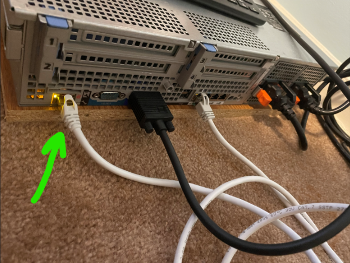
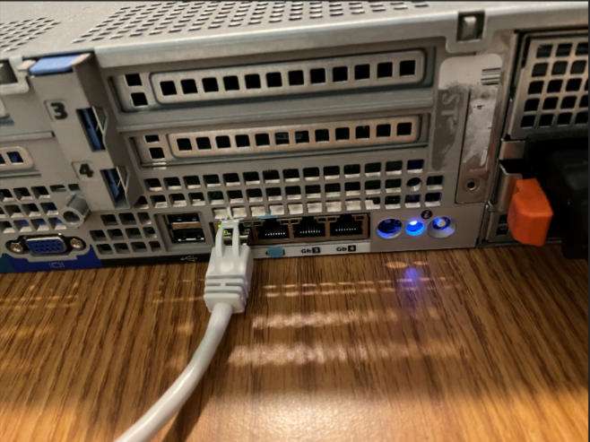
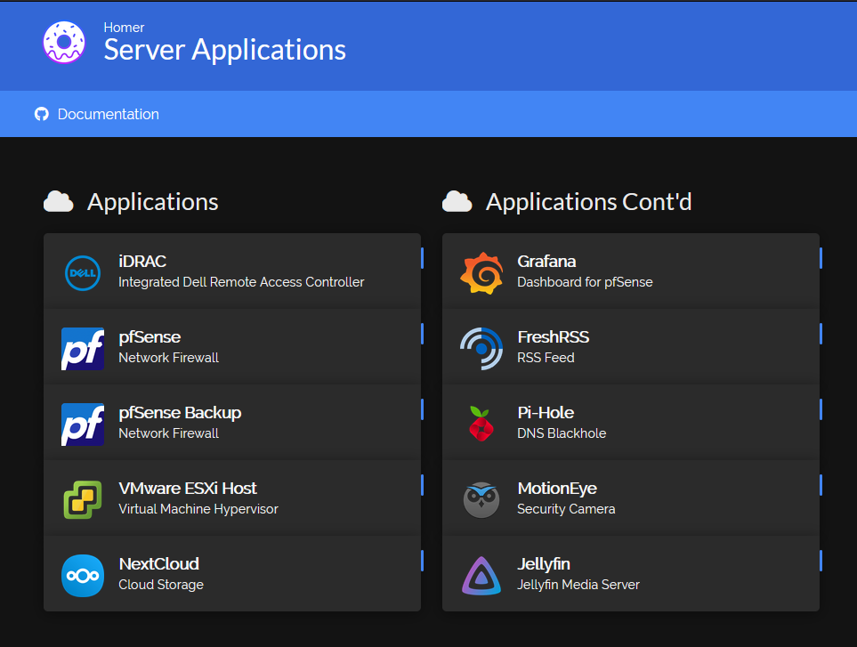
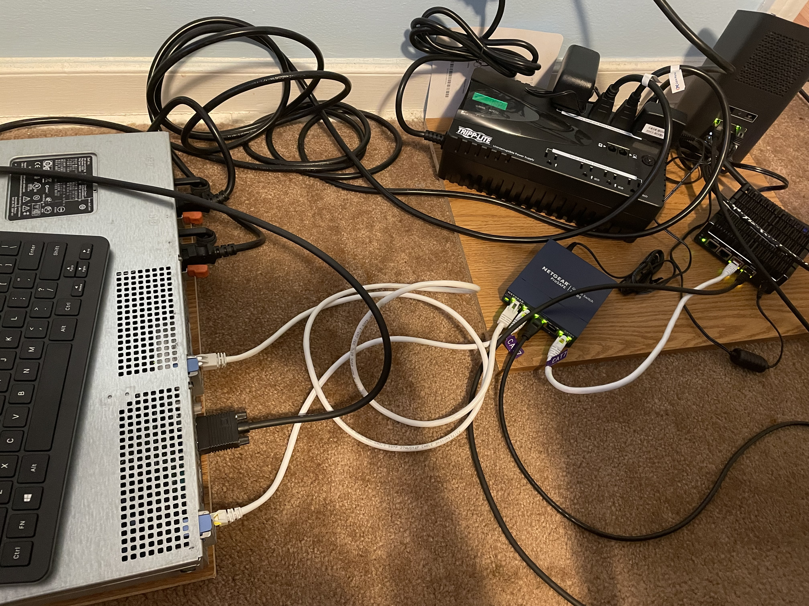

# Homelab

## Introduction

I wanted to build a Homelab for myself in order to get enterprise experience without having an enterprise-caliber occupation. I then started doing research and asking around until I found a setup that worked for me. This write-up is my journey through creating my Homelab.

## Materials

### Hardware

| Type | Name | Cost \(USD $\) |
| :--- | :--- | :--- |
| Firewall | Protectli Vault 4 Port​ | 319.00 |
| Power strip with surge protector​ | Tripp Lite 650VA UPS Battery Backup, LCD, 325W Eco Green, USB, RJ11, 8 Outlets ​ | 95.08​ |
| Server​ | Dell PowerEdge R710 2U Server X5650 2.66GHz 12-Cores / 64gb / 3x 1TB SAS / 2xPSU​ | 326.76​ |
| Cat 8 Ethernet Cable​ | Cat8 Ethernet Cable, Outdoor&Indoor, 6FT Heavy Duty High Speed 26AWG Cat8 LAN Network Cable 40Gbps, 2000Mhz with Gold Plated RJ45 Connector, Weatherproof S/FTP UV Resistant for Router/Gaming​ | 8.99 |
| Cat 7 Ethernet Cable​ | Cat7 Ethernet Cable 1.5 ft \(2 Pack\) RJ45 Connector - Double Shielded STP - 10 Gigabit 600MHz​ | 7.49 |
| Cat 7 Ethernet Cable​ | Amazon Basics RJ45 Cat 7 High-Speed Gigabit Ethernet Patch Internet Cable, 10Gbps, 600MHz - White, 5-Foot​ | 6.99​ |
| Unmanaged Switch​ | NETGEAR 5-Port Gigabit Ethernet Unmanaged Switch \(GS105NA\)​ | 28.99​ |
| Power Cord​ | Cable Matters 2-Pack 16 AWG Heavy Duty 3 Prong Computer Monitor Power Cord in 15 Feet, UL Listed \(NEMA 5-15P to IEC C13\)​ | 24.99​ |
| Total |  | 818.29 |

### Software/OS

| Type | Name |
| :--- | :--- |
| Firewall | pfSense |
| Virtualization \(Type I Hypervisor\) | VMware ESXi 6.5U3​ |
| Cloud​ | NextCloud​ |
| RSS Feed​ | FreshRSS​ |
| Password/Hash Cracking​ | Kali Linux​ |
| Media System | Jellin |
| Dashboard | Homer |

## Firewall Setup

| Hardware | Software |
| :--- | :--- |
| Protectli Vault 4 Port | pfSense |

I setup the firewall first, since all of the data was going to go through the Firewall. I used [Michael Bazzell's Book](https://www.amazon.com/Extreme-Privacy-What-Takes-Disappear/dp/B094LDWKGZ/) in order to setup pfSense on my Protectli Vault. The steps \(for me\) were as follows:​

* Installation
  * www.pfsense.org/download
  * Architecture: AMD64 \| Installer: USB Memstick Installer \| Console: VGA \| Mirror: New York​
  * Download the .gz file and decompress it​
    * You can use 7-zip for this​
    * You should end up with a "pfSense......-amd64.img" file​
  * Download Rufus or Etcher \(flashing programs\)​
  * Flash the pfSense file onto a USB device​
  * Power down Vault, if not powered down already​
  * Connect a USB keyboard and monitor to the Vault​
  * Insert USB into another USB port​
  * Power on the device​
  * Enter in all the defaults​
  * After the installation is complete, disconnect USB keyboard and Monitor​
  * Go to 192.168.1.1 -&gt; user:admin / password:pfsense​
  * Click Advanced to allow the page to load​
  * Accept all defaults by clicking "Next", "Close", and "Finish"​
* Activate Ports
  * Activate Ports \(only applicable for 4-port & 6-port\)​
  * Access the pfSense Web interface​
  * "Interfaces" -&gt; "Assignments"​
  * Click "Add" option next to each empty port​
  * Repeat until all ports have been added​
  * Save Changes​
  * Click through each new port \("Interfaces" &gt; "Opt1"/"Opt2"\)​
    * Enable each port by checking the first box​
    * Save change​
    * Do this for all ports​
      * "Interfaces" -&gt; "Assignments"	to continue for the next port​
  * When finished will all of them, apply changes in the upper right​
  *  "Interfaces" -&gt; "Assignments" -&gt; "Bridges"​
  * Click on "Add" to create a new bridge​
  * Select the LAN option and the other ports that was added with a CNTRL-CLICK or CMD-CLICK​
  * Provide a description, such as "bridge", and then hit "Save"​
  * "Firewall" -&gt; "Rules"​
  * Click each port \(Opt, Opt2, etc.\) and click the "Add" button \(up arrow\) for each​
  * Change "Protocol" to "Any"​
  * Click "Save" after each port is modified​
  * Apply changes in the upper right after all the ports have been added​
  * "Interfaces" -&gt; "Assignments"​
  * Click on "Add" next to "BRIDGE0" and click "Save"​
  * Click on a bridge, maybe called "Opt3" or "Opt5"​
  * Enable the Interface and change the description to "bridge"​
  * Click "Save", then "Apply Changes"​
  * "Firewall" -&gt; "Rules"​
  * Click on "Bridge", then the "Add" button \(up arrow\)​
  * Change the "Protocol" to "Any" and click "Save"​
  * Apply changes in the upper-right​
* Prevent DNS leakage
  * "System" -&gt; "General Setup"​
  * Add "1.1.1.1" as a DNS server, and choose the "WAN\_DHCP-wan" interface​
  * Click "Add DNS Server"​
  * Add "1.0.0.1" as a DNS server and choose the "WAN\_DHCP-wan" interface​
  * Disable "DNS server override"​
  * Click "Save"​
* Enable AES-NI CPU Crypto & PowerD​
  * "System" -&gt; "Advanced"​
  * Click on the "Miscellaneous" tab​
  * Locate the "Cryptographic & Thermal Hardware"​
  * Select "AES-NI CPU-based Acceleration" in the drop-down​
  * "System" -&gt; "Advanced" -&gt; "Miscellaneous" -&gt; "Power Savings" -&gt; Enable "PowerD"​
* Disable Notifications​
  * "System" -&gt; "Advanced" -&gt; "Notifications"​
  * Under the "E-mail" section, disable "SMTP Notifications"​
  * In the "Sounds" section, check the "Disable startup/shutdown beep"​
  * Click "Save"​

To test your DNS setup, you can use [DNSleaktest](https://www.dnsleaktest.com/). 

### Privacy

I believe that privacy is an important aspect of our lives. With that being said, here are some changes I added to my pfSense to make my firewall more private. I found a list of Windows telemetry domains on​ [Github](https://github.com/kevinle-1/Windows-Telemetry-Blocklist/blob/master/windowsblock.txt). I then added those to my pfSense using [this guide](https://linuxincluded.com/block-ads-malvertising-on-pfsense-using-pfblockerng-dnsbl/). Using the same guide, I was able to choose more blocklists from pfSense's recommended list under \(Firewall -&gt; pfblockerNG -&gt; Feeds\). I also chose to add [Apple's Telemetry blocking list](https://raw.githubusercontent.com/adversarialtools/apple-telemetry/master/blacklist) to the blacklist as well using "TLD Blacklisting".

## Server Setup

| Hardware | Software |
| :--- | :--- |
| Dell PowerEdge R710 2U Server X5650 2.66GHz 12-Cores / 64gb / 3x 1TB SAS / 2xPSU \| VMware ESXi 6.5U3 | FreshRSS​ |
|  | NextCloud​ |
|  | Kali Linux​ |
|  | Jellyfin |
|  | Homer |

My server came cleaned or "Factory Reset" so my steps are going to be after that is completed. ​

### Network Setup

This part was straight forward on my end. I connected a Ethernet cable from the server to my switch \(which was connected to my router\) .

The ethernet cable on the left \(white cable\) is for the network of the server.​

I connected a monitor and USB Keyboard to my server so I can see what is going on. My server is a bit older so it booted up for 3-4 minutes, and then it showed an IP Address for the server. You should be able to connect to that IP Address through your browser. I have IDRAC \(Integrated Dell Remote Access Controller 6\), so that is what I am accessing on the web. After the login screen \(user: **root** / password: **calvin**\), I then went on the login screen: ​

### RAID-5 Setup

I wanted to have a backup system for my server. I used [RAID](https://en.wikipedia.org/wiki/RAID) \(Redundant Array of Inexpensive Disks\)​ in order to have a backup, more importantly RAID-5. RAID-5 is meant to work with 3 disks, and since I had 3 1TB hard drives, this was the best RAID model for me. After my server booted up, I tapped \*\*CNTRL+R\*\* in order to run the Configuration Utility. I then followed [this Youtube video](https://www.youtube.com/watch?v=sp7XV2x-CZc) in order to setup RAID-5 on my server. I set it up on a screen resembling this:

### VMware ESXi Setup

I downloaded ESXi from​ [VMware](https://my.vmware.com/web/admin/). For my server, the version that worked was 6.5U3 \(Version 6.5 Update 3\). I used [this link](https://kb.vmware.com/s/article/2107518?lang=en_US&queryTerm=esxi+6+5+download) to find out how to find the download and how to find the license for my product. Since mine was a Dell Server, I first went to the VMware to to find the right file:

I then downloaded and then used [Balena Ether](https://www.balena.io/etcher/) in order to flash the ISO onto my USB drive. I then plugged my USB into my server and booted from the USB. I do not have screenshots to walk-through that part, but I can rephrase what I did:


 If you do not use RAID, you will still need to "virtualize" your disks that way ESXi can use it as storage.​


* Plugged in my USB 2.0 with the Dell ESXi ISO flashed on it​
* Connected my second ethernet cable to one of the 4 ethernet ports in the back :

* Powered on the server​
* Waited until I was able to press "F11"​
* Booted off of the USB​
* When asked for where to setup ESXi, I chose my RAID-5 virtual disk​
* I then waited for the packages in ESXi download, and I ended up on a page \(half yellow / half black\)​
  * This shows the IP the ESXi is on your network​
* I then was able to connect to the ESXi host, and start making VMs​

## My Setup

At this point, I configured the server to my needs. I will go into detail about what I did so it is clear if someone in the future wanted to replicate it.​

### ESXi VMs

Nextcloud: My locally hosted cloud, so I do not have to rely on third-party software or SaaS providers.​

Dashboard: This is an Ubuntu VM with 2 docker containers and Grafana:​

[Homer](https://github.com/bastienwirtz/homer) is a self-hosted dashboard for all of your server applications:

[FreshRSS](https://www.freshrss.org/) is an open-source RSS Feed.

[Grafana](https://grafana.com/) is a dashboard for information usually in some sort of infographic:

I use Grafana for looking at pfSense data. I followed​ [Grafana dashboard for pfSense by PSYCHOGUN](https://psychogun.github.io/docs/pfsense/Grafana-dashboard-for-pfSense/#install-influxdb) to set mine up. I just had to change some settings on my end, since they did not work for me, but I got it setup. I did not setup TLS on mine, but it would be a good idea to do so.

[Jellyfin](https://jellyfin.org/docs/index.html) is an open-source alternative to Plex. I use this for video game clips and more. 

[Kali Linux](https://www.kali.org/) is a Linux distribution meant for penetration testing. My plan is to use this for hash cracking and WPA handshake cracking.

