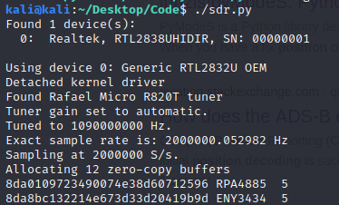
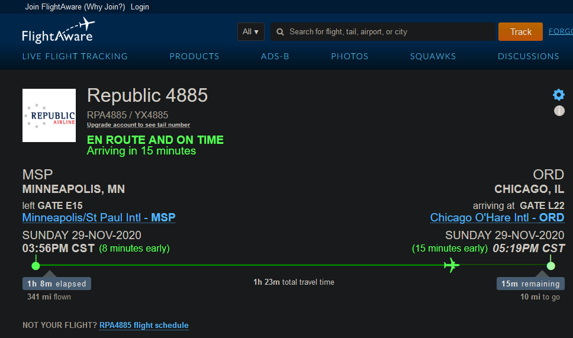
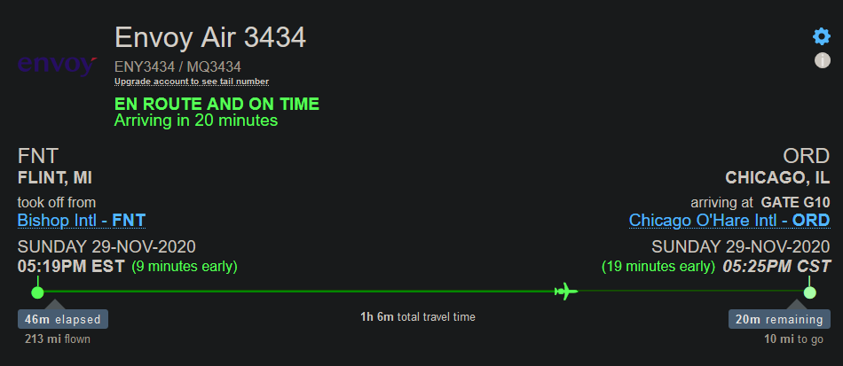

# Coding an SDR program

After playing around with the [RTL-SDR](https://www.amazon.com/RTL-SDR-Blog-RTL2832U-Software-Defined/dp/B011HVUEME/) and the softwares that work alongside ADS-B \(Automatic Dependent Surveillance-Broadcast\), I wanted to build my own code that would do this, just out of curiosity. I have leveraged the [rtl\_adsb](http://manpages.ubuntu.com/manpages/trusty/man1/rtl_adsb.1.html) command on Linux that changes all the data from the 1090 MHz frequency into 30 character string outputs. I have then used those outputs in order to decode them, and then display the flight name from each output to the user.

In the image below there are 3 fields that can be seen: a 28 character string, a 6 character string, and a number \(all separated by a space\). The 28 character string is the output trimmed down from 30 characters, so that way decoding the information would be easier for me. The 28 characters left are the flight information in hex-string format. The 6 character string is a decoded version of the plane callsign derived from the 28 character string mentioned earlier. The last number \(which was for testing purposes\) is the Transponder Capability or CA of the plane. The code that I had created and used can be accessed [here](https://github.com/harisqazi1/Blog/blob/main/Code/RTL-SDR-PlaneTracking.py). I still have more modifications to make to the code, and is just a work in progress currently. CAVEAT: The code does take 1-2 minutes to gather the data before it starts displaying. The snippet below shows where the output comes from in the code \(line 61 and 62\):

```python
if (decimal_Char==8 and decimal_Char2==13 and decTC==4):#decDF == 17):
            print(Whole_message , Callsign, decCA)
```

Here are some images from this project, including the output of the program I had written:







#### Code that I wrote:

```python
#!/bin/python3

import os
import subprocess
from subprocess import Popen, PIPE
#filters output

proc = subprocess.Popen(['rtl_adsb'],stdout=subprocess.PIPE) #runs the rtl_adsb command
try:
    while True:
        line = proc.stdout.readline().decode('unicode_escape')
        if not line:
            break
        Whole_message = line[1:29] #The intercept in Hex NOT CHANGED
        binWM = "{0:08b}".format(int(Whole_message, 16))
        #binary
        Downlink_Format = DF = binWM[0:5]
        Transponder_Capability = CA = binWM[5:8]
        ICAO24_Address = ICAO = binWM[8:32]
        Type_Count = TC = binWM[32:37]
        Surveillance_status = SS = binWM[37:39]
        NIC_supplement_B = NICsb = binWM[39]
        Altitude = Alt = binWM[40:51]
        Time = T = binWM[52]
        CPR_odd_even_frame_flag = F = binWM[53]
        Latitude_CPR_format = LAT_CPR = binWM[54:71]
        Longitude_CPR_format = LONG_CPR = binWM[71:88]
        CRC = binWM[88:124]
        character_map = "#ABCDEFGHIJKLMNOPQRSTUVWXYZ##### ###############0123456789######"
        Flight_Character_1 = FC1 = character_map[int(binWM[40:46],2)]
        Flight_Character_2 = FC2 = character_map[int(binWM[46:52],2)]
        Flight_Character_3 = FC3 = character_map[int(binWM[52:58],2)]
        Flight_Character_4 = FC4 = character_map[int(binWM[58:64],2)]
        Flight_Character_5 = FC5 = character_map[int(binWM[64:70],2)]
        Flight_Character_6 = FC6 = character_map[int(binWM[70:76],2)]
        Flight_Character_7 = FC7 = character_map[int(binWM[76:82],2)]
        Flight_Character_8 = FC8 = character_map[int(binWM[82:88],2)]
        Callsign = FC1 + FC2 + FC3 + FC4 + FC5 + FC6 + FC7 + FC8
        #decimal
        decimal_Type_Code = decTC = int(TC,2)
        decimal_Char = int(line[1],16)
        decimal_Char2 = int(line[2],16)
        decimal_Altitude = decAlt = int(Alt,2)
        decimal_Transponder_Capability = decCA = int(CA,2)
        decimal_ICAO24_Address = decICAO = int(ICAO,2)
        decimal_Downlink_Format = decDF = int(DF,2)

        if (decimal_Char==8 and decimal_Char2==13 and decTC==4):#decDF == 17):
            print(Whole_message , Callsign, decCA)

        #print("Decodable:", Whole_message , Callsign, decAlt)
        #print(Whole_message)
        #print("Plane: ", line.rstrip())
except KeyboardInterrupt:
    pass
```

Here are the resources I used for to make this possible:

* [https://osmocom.org/projects/rtl-sdr/wiki/Rtl-sdr](https://osmocom.org/projects/rtl-sdr/wiki/Rtl-sdr)
* [http://manpages.ubuntu.com/manpages/trusty/man1/rtl\_adsb.1.html](http://manpages.ubuntu.com/manpages/trusty/man1/rtl_adsb.1.html)
* [https://stackoverflow.com/questions/2804543/read-subprocess-stdout-line-by-line](https://stackoverflow.com/questions/2804543/read-subprocess-stdout-line-by-line)
* [https://stackoverflow.com/questions/699866/python-int-to-binary-string](https://stackoverflow.com/questions/699866/python-int-to-binary-string)
* [https://raw.githubusercontent.com/junzis/the-1090mhz-riddle/master/book.pdf](https://raw.githubusercontent.com/junzis/the-1090mhz-riddle/master/book.pdf)
* [http://airmetar.main.jp/radio/ADS-B%20Decoding%20Guide.pdf](http://airmetar.main.jp/radio/ADS-B%20Decoding%20Guide.pdf)
* [https://mode-s.org/decode/content/ads-b/2-identification.html](https://mode-s.org/decode/content/ads-b/2-identification.html)

