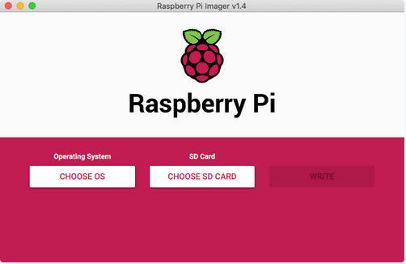
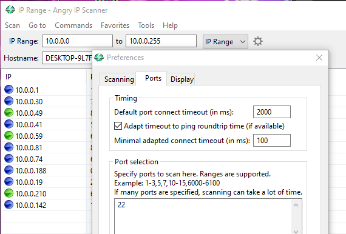
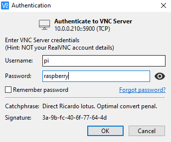
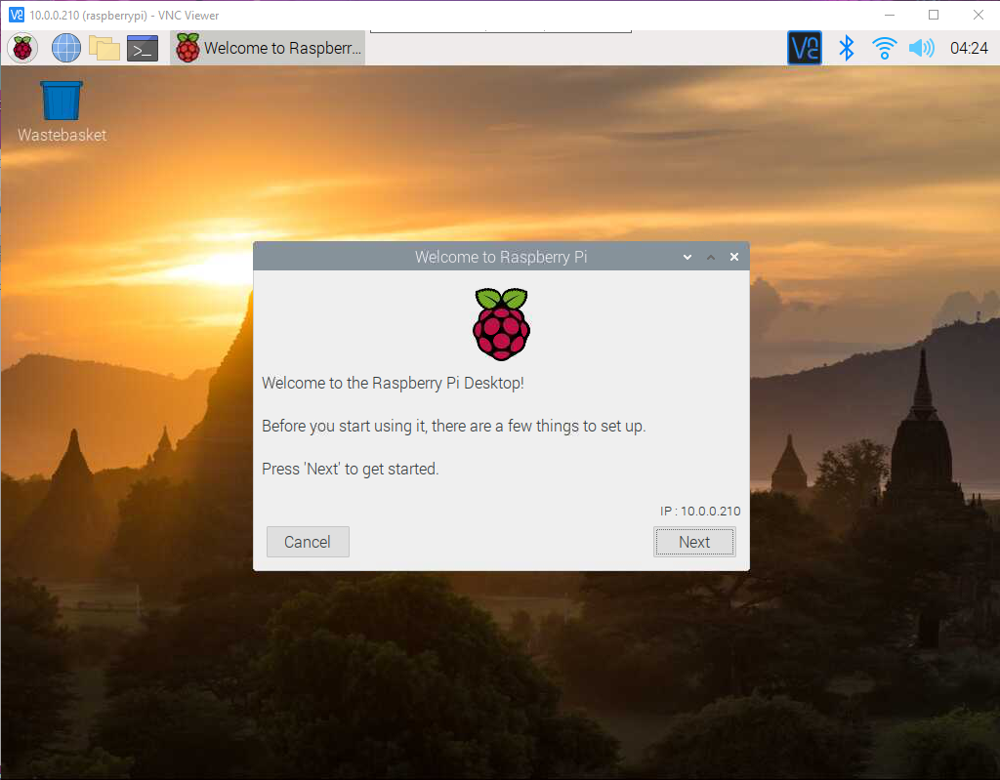
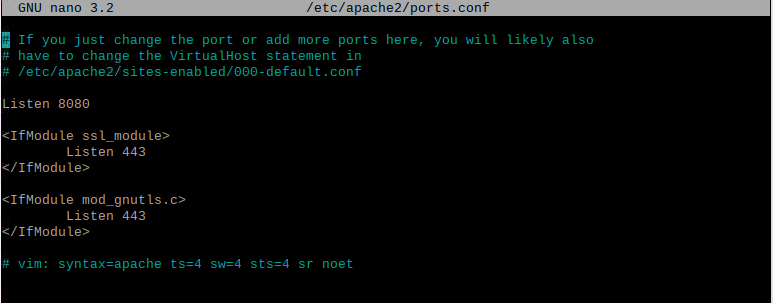

# Raspberry Pi Portable Hacking Station

### Introduction

Looking at devices such as the [esp8266\_deauther](https://github.com/SpacehuhnTech/esp8266_deauther) and the [P4wnP1 A.L.O.A.](https://github.com/RoganDawes/P4wnP1_aloa), I realized that I wanted to create something like this. I am not the best at C, especially not for kernel and WiFi coding. With that being said, I chose the route to bring together resources in order to create a Raspberry Pi which is able to do hacking \(the way I wanted it to\). Obviously, you can download a Raspberry Pi image of Kali Linux or download the [STICKY FINGERS KALI-PI](https://whitedome.com.au/re4son/sticky-fingers-kali-pi/) image file and flash it onto the Pi. I think there are limitations to flashing a pre-made image, as you are not able to modify as much as you want. That is the reason I started this project, to customize a hacking tool for practical usage.

### End Result

At the end of this project, you will have a Raspberry Pi that has :

* SSH \(Secure Shell\)
* VNC \(Virtual Network Computing\)
* Hacking software \(same ones used in Parrot and Kali OSes\)
* A wireless access point
* A web server

### Materials

* Raspberry Pi \(3B+ preferred\)
* Raspberry Pi Power Supply
* MicroSD card \(anything above 25 GB for all the tools, but 16 GB works too\)
* MicroSD card adapter
* A wifi adapter \(I used the [Panda Wifi Adapter](https://www.amazon.com/Panda-300Mbps-Wireless-USB-Adapter/dp/B00EQT0YK2/)\)
* Connection to a Wifi network 
* A PC or laptop \(in order to flash the SD card\)

### Step \#1 - Raspberry Pi Setup

Head to [https://www.raspberrypi.org/software/](https://www.raspberrypi.org/software/) and download the official Raspberry Pi Imager. I believe that a 32-bit version of Raspbian comes built into the Imager. If it is not available, you can download it from [https://www.raspberrypi.org/software/operating-systems/](https://www.raspberrypi.org/software/operating-systems/). I would recommend downloading the "Raspberry Pi OS with desktop and recommended software" version. After installing the Imager, you should see a window like:



For the OS \(Operating System\), we will choose the "Raspberry Pi OS \(32-bit\)" or where you saved the image downloaded earlier. For the SD card, you choose the plugged in SD Card. After that, click on the "Write" button. After this, we have to plug the SD card back into the PC we are using to flash the SD card. We are going to run this Pi in "headless mode". This means that there are no peripherals \(monitor, keyboard, etc.\) directly connected to the Raspberry Pi. After connection, we will create 2 files on the SD card: ssh and wpa\_supplicant.conf. On macOS, we can run:

```bash
cd /Volumes/boot #Change directory into boot -- boot is the name of the SD card
touch ssh #this creates the ssh file
nano wpa_supplicant.conf #opens the file wpa_supplicant for us to edit
```

The nano command, opens a window, where we can enter text. In the text editor, we will enter:

```bash
#Source for this file: https://raspberrypi101.com/basics/how-to-connect-to-wi-fi-network-with-wpa_supplicant-on-raspberry-pi/
country=US #change to your own country
ctrl_interface=DIR=/var/run/wpa_supplicant GROUP=netdev
update_config=1

network={
ssid="YOUR-WI-FI-SSID-HERE"
psk="WI-FI_Password-here"
}
```

You will have to edit your ssid \(WiFi name\) and psk \(WiFi password\). After this, you can press CNTRL+S \(to save\) and CNTRL+X \(to exit\). We can then close the terminal, and eject the SD card. 

Next, we will use a software in order to find the IP address of the Raspberry Pi so we can connect to the Pi using SSH. I used [Angry IP Scanner](https://angryip.org/download/#windows), but an Nmap scan can do the trick. In order to make it easier to find our pi, we can change our preferences to scan only for port 22 \(the default port for SSH\). We can do this by clicking on the cog-type wheel, next to the IP range selection box. 



One of the hostnames should be "raspberrypi.local", and this is what we are looking for. We can write the IP address of this down, and then use a software such as [PuTTY](https://www.chiark.greenend.org.uk/~sgtatham/putty/latest.html) to connect to the Pi using SSH. We can enter the IP address of the Pi. The username of the raspberry pi is "pi", and the password is "raspberry". The display should look as the following:


### Step \#1.1 - VNC \(OPTIONAL\)

VNC is a software that allows a person to look at the desktop of a machine \(Raspberry Pi, in our case\), without attaching a monitor to the machine. We will use this to connect to the Raspberry Pi. We have to configure the Raspberry Pi in order to be setup for the vnc. To do this we can run "**sudo raspi-config**", which will allow us to configure the Pi. The first thing we have to change is Display. Under "Display Options", we see "Resolution". In Resolution, we have to change it to something that is NOT the "Default". For me, "DMT Mode 4 640x480 60Hz 4:3" works for me. Next, under "Interfaces", we have to enable VNC. After that, we can select "Finish" at the bottom, and then reboot the system. 

In order to connect to the VNC server on the Pi, we have to use a software to connect to it. We can use [RealVNC Viewer](https://www.realvnc.com/en/connect/download/viewer/), in order to connect to the Pi. We can enter the same IP address as we did earlier in the search bar on the top, and it should bring us to a display:



Pressing "OK" should show us the desktop of the Raspberry Pi.



### STEP \#1.2 - Updating/Upgrading and root config

In the terminal, we will run the following commands:

```bash
sudo apt-get update && sudo apt-get upgrade #this will update the sources and upgrade the softwares
sudo passwd root #to change the root password
```

### STEP \#2 - Hacking Software

In order to get hacking software onto our Pi, there are 2 main methods: you can either download the software/code from online OR you can put kali linux sources in your **/etc/apt/sources.list** file. In this tutorial, I will be going with the second option. The documentation to the Kali Linux source file can be found at: [https://www.kali.org/docs/general-use/kali-linux-sources-list-repositories/](https://www.kali.org/docs/general-use/kali-linux-sources-list-repositories/). From this website there are only lines we have to copy to our sources.list file on the Pi:

```bash
deb http://http.kali.org/kali kali-rolling main contrib non-free
```

After this is done, we will run "**sudo apt-get update**", and this will update the sources. From the Kali source, we will need [mdk4](https://github.com/aircrack-ng/mdk4), a WiFi exploiting tool. In order to download this we can run:

```bash
sudo apt-get install mdk4
```

This downloads the mdk4 tool, and then it adds the command to the terminal commands that way we are able to run the command without any other effort. This is where the WiFi adapter comes into play. A Raspberry Pi \(3B+\), although capable to WiFi connection on its own, is not able to inject packets and play around with networks as an adapter is. We can download a bunch of tools using [metapackages](https://www.kali.org/docs/general-use/metapackages/). To use that, we can run: **sudo apt-get install kali-linux-large** \(You can replace large with another metapackage name\). If you run the previous command, you will have to run the following commands to make sure it is setup correctly \(your mileage may vary\):

```php
sudo apt-get install tightvncserver #you need this for kali-linux-default
sudo apt-get install kali-linux-default #you need this for kali-linux-large
sudo apt-get install kali-linux-large #the actual package
```

You can also use [Katoolin](https://github.com/LionSec/katoolin), which is script that allows you to install the hacking software/tools.


If you are going to use Katoolin, remove the kali sources from the **/etc/apt/sources.list** file


### STEP \#3 - Web Server

When we have all the Kali \(and Parrot\) hacking software at our disposal, we can use them from the command line however we want. However, I do believe that having a website that allows you to run commands with a press of a button "[Watch Dogs](https://en.wikipedia.org/wiki/Watch_Dogs)" style has a coolness factor to it. This is what the website is meant to be: a way to efficiently run hacking commands with minimal effort. In this tutorial, we will be using Apache as the web server. To set this up we can run the following command

```bash
sudo apt-get install apache2 
```

In order to check if the web server is running is running, we can run the following command:

```text
sudo systemctl status apache2	
```

If your output looks like the following, you should be able to see a webpage on **http://localhost/**:


Next, we are going to move the port that Apache is working on. Apache currently works on port 80 \(HTTP\), and we can change that \(it is optional\). To do this, we can [edit a file to change the port](https://www.tecmint.com/change-apache-port-in-linux/):

```text
sudo nano /etc/apache2/ports.conf 
```

We will replace the 80, with any port we want \(anything under 1024 is good\). Here I will do, 8080. After this is done, your file should like mine:



We will restart the Apache web server using "**sudo systemctl restart apache2**". In order to double check that it is still working, we can run "**sudo systemctl status apache2**". There should be a website on "[http://localhost:8080/](http://localhost:8080/)" \(replace 8080 with your own port number\). Here we will be creating our own website, that way the website and the commands work together. In order to do this, we will have to run the following command:

```text
sudo apt-get install php
```

This will install php and its dependencies. We will use php for the website that way we can connect the website to Linux commands. The directory where we where will edit the files for the website are located at **/var/www/html/** in the Raspberry Pi folder structure. In order to be able to run commands from the website, we will have the website to the sudoers file. We can run "**sudo nano /etc/sudoers**" and add the following the file:

```text
www-data ALL=(ALL:ALL) ALL #add this under the root
```

My code for the website is the following, but you can change it to look/act how you want to. The following code is **NOT COMPLETED**. If you were to use it, place this code in "**/var/www/html&lt;filename&gt;.php**".

```php
<!DOCTYPE html> 
<html> 
<head> 
    <title> 
	Hack Central
    </title> 
</head> 
  
<body style="text-align:center;"> 
      
    <h1 style="color:green;"> 
       	Hack Central 
    </h1> 
      
    <h4> 
	Choice for Hacking?
    </h4> 
      <tbody>
    <?php
        
        if(array_key_exists('button1', $_POST)) { 
            button1(); 
        } 
        else if(array_key_exists('button2', $_POST)) { 
            button2(); 
        }
        else if(array_key_exists('button3', $_POST)) { 
            button3(); 
        }
        function button3() { 
            $command = "ls -la"; //sudo airmon-ng start wlan1
            exec($command.' 2>&1', $outputAndErrors, $return_value);
            print "<p style=\"border:3px; border-style:solid; border-color:#FF0000; padding: 1em;\">";
            foreach($outputAndErrors as $output) {
                print "$output <br>";
            }
            print "</p>";
        } 
        function button1() { 
            echo "This is Button1 that is selected";
            $command = "sudo airmon-ng start wlan1 && sudo timeout 15 mdk4 wlan1mon b -f wifi_beacon_list";
            exec("$command 2>&1");
        } 
        function button2() { 
            echo "This is Button2 that is selected"; 
        } 
        
    ?> 
  </tbody>
    <form method="post"> 
        <input type="submit" name="button3"
                class="button" value="Airmon-ng start" />
                
        <input type="submit" name="button1"
                class="button" value="Button1" /> 
          
        <input type="submit" name="button2"
                class="button" value="Button2" /> 
                
    </form> 
</head> 
  
</html> 
<!-- Edited version from https://www.geeksforgeeks.org/how-to-call-php-function-on-the-click-of-a-button/ -->

```

You should be able to see a webpage, as the following, if everything is done correctly:



If you want to host an Apache webserver AND a RaspAP on different sites, you can do that, but I did not do that. The next command, will overwrite your current Apache site.


### Step \#4 - RaspAP

run the following the following command \(either one\):

```php
#you get to choose the options
curl -sL https://install.raspap.com | bash
#without any prompts
curl -sL https://install.raspap.com | bash -s -- --yes 
```

This will download RaspAP on our Pi.

If you now try to go to **localhost**, you will see the following screen:


This is asking for the RaspAP's password. The username is: **admin**. The password is: **secret**. More information about RaspAP can be found [here](https://github.com/RaspAP/raspap-webgui). **Make sure to reboot at this point.** The reboot will make sure your files are all set up for the AP to be ready. After the reboot is completed, you should see an access point called "**raspi-webgui**". Connect to it, and after connection, head to **localhost:&lt;port number&gt;**. The most ideal usage for this would be through SSH. In order to do that, you can SSH to &lt;user&gt;@10.3.141.1. If this does not work, you can run "ping raspberry.local", and it will show you the IP address of the RaspAP. 


I would highly reccomend that you install kali-linux-everything prior to setting up the RaspAP. This way you have all the tools you need on the Pi. I have unsuccessfully tried to connect the Pi to my local network after the download of RaspAP and have had no luck. 



