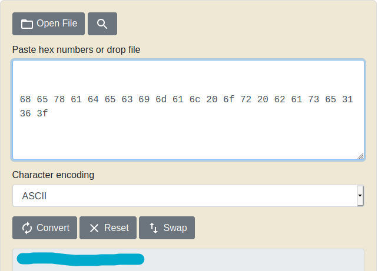
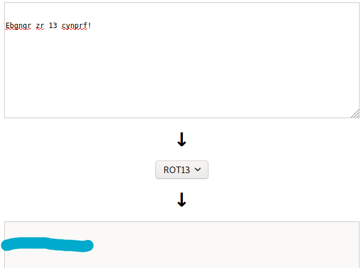
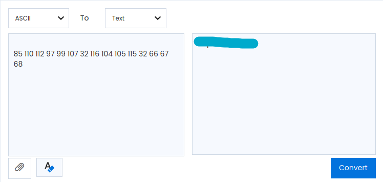
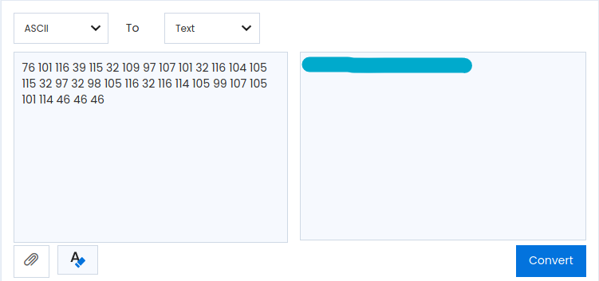
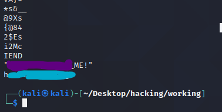

# c4ptur3-th3-fl4g

### This is a write-up for the TryHackMe room located at: [https://tryhackme.com/room/c4ptur3th3fl4g](https://tryhackme.com/room/c4ptur3th3fl4g)

## Task 1: Translation & Shifting

```aspnet
c4n y0u c4p7u23 7h3 f149?
```

This seems to be in leetspeak format. I manually was able to convert it, but you can use a website such as [this one](https://www.dcode.fr/leet-speak-1337) to decode it. I then got the flag:


```aspnet
01101100 01100101 01110100 01110011 00100000 01110100 01110010 01111001 00100000 01110011 01101111 01101101 01100101 00100000 01100010 01101001 01101110 01100001 01110010 01111001 00100000 01101111 01110101 01110100 00100001
```

This seems to be in binary format. I looked for a binary to ascii converter online.


```aspnet
MJQXGZJTGIQGS4ZAON2XAZLSEBRW63LNN5XCA2LOEBBVIRRHOM======​
```

To me, this seemed to be Base32 or Base64. I tried Base64 and it did not work. I then tried Base32, I then got the flag:


```aspnet
RWFjaCBCYXNlNjQgZGlnaXQgcmVwcmVzZW50cyBleGFjdGx5IDYgYml0cyBvZiBkYXRhLg==​
```

For this one, the last two characters "==" led me to believe that this was Base64, and this led me to get the flag:


```aspnet
68 65 78 61 64 65 63 69 6d 61 6c 20 6f 72 20 62 61 73 65 31 36 3f​
```

To me, my first thought was this could be hex because of the "3f" at the end. My intuition was correct, and I got the flag:



```aspnet
Ebgngr zr 13 cynprf!​
```

For this, I tried ROT13, and got it on the first run:



```aspnet
*@F DA:? >6 C:89E C@F?5 323J C:89E C@F?5 Wcf E:>6DX​
```

For this one, I used [this writeup](https://www.youtube.com/watch?v=e3jucz07V68) to get help for it and found out it was rot47:


```aspnet
- . .-.. . -.-. --- -- -- ..- -. .. -.-. .- - .. --- -.. -. -.-. --- -.. .. -. --.​
```

This seemed to be morse code for me. It was!:


```aspnet
85 110 112 97 99 107 32 116 104 105 115 32 66 67 68​
```

For this CTF, I assumed that this would be ASCII because of the numbers above 100. I got the flag after I entered this into an online decoder:



```aspnet
LS0tLS0gLi0tLS0gLi0tLS0gLS0tLS0gLS0tLS0gLi0tLS0gLi0tLS0gLS0tLS0KLS0tLS0gLi0tLS0gLi0tLS0gLS0tLS0gLS0tLS0gLi0tLS0gLS0tLS0gLi0tLS0KLS0tLS0gLS0tLS0gLi0tLS0gLS0tLS0gLS0tLS0gLS0tLS0gLS0tLS0gLS0tLS0KLS0tLS0gLi0tLS0gLi0tLS0gLS0tLS0gLS0tLS0gLS0tLS0gLS0tLS0gLS0tLS0KLS0tLS0gLi0tLS0gLS0tLS0gLi0tLS0gLi0tLS0gLi0tLS0gLi0tLS0gLi0tLS0KLS0tLS0gLi0tLS0gLi0tLS0gLS0tLS0gLS0tLS0gLS0tLS0gLS0tLS0gLS0tLS0KLS0tLS0gLS0tLS0gLi0tLS0gLS0tLS0gLS0tLS0gLS0tLS0gLS0tLS0gLS0tLS0KLS0tLS0gLi0tLS0gLi0tLS0gLS0tLS0gLS0tLS0gLS0tLS0gLS0tLS0gLS0tLS0KLS0tLS0gLi0tLS0gLi0tLS0gLS0tLS0gLS0tLS0gLS0tLS0gLS0tLS0gLS0tLS0KLS0tLS0gLi0tLS0gLi0tLS0gLS0tLS0gLS0tLS0gLi0tLS0gLS0tLS0gLi0tLS0KLS0tLS0gLS0tLS0gLi0tLS0gLS0tLS0gLS0tLS0gLS0tLS0gLS0tLS0gLS0tLS0KLS0tLS0gLi0tLS0gLi0tLS0gLS0tLS0gLS0tLS0gLS0tLS0gLi0tLS0gLS0tLS0KLS0tLS0gLi0tLS0gLi0tLS0gLS0tLS0gLi0tLS0gLS0tLS0gLS0tLS0gLS0tLS0KLS0tLS0gLS0tLS0gLi0tLS0gLS0tLS0gLS0tLS0gLS0tLS0gLS0tLS0gLS0tLS0KLS0tLS0gLi0tLS0gLi0tLS0gLS0tLS0gLS0tLS0gLS0tLS0gLS0tLS0gLS0tLS0KLS0tLS0gLi0tLS0gLi0tLS0gLS0tLS0gLS0tLS0gLS0tLS0gLS0tLS0gLS0tLS0KLS0tLS0gLi0tLS0gLi0tLS0gLS0tLS0gLS0tLS0gLi0tLS0gLS0tLS0gLS0tLS0KLS0tLS0gLS0tLS0gLi0tLS0gLS0tLS0gLS0tLS0gLS0tLS0gLS0tLS0gLS0tLS0KLS0tLS0gLi0tLS0gLi0tLS0gLS0tLS0gLS0tLS0gLS0tLS0gLi0tLS0gLS0tLS0KLS0tLS0gLi0tLS0gLi0tLS0gLS0tLS0gLS0tLS0gLS0tLS0gLS0tLS0gLi0tLS0KLS0tLS0gLS0tLS0gLi0tLS0gLS0tLS0gLS0tLS0gLS0tLS0gLS0tLS0gLS0tLS0KLS0tLS0gLi0tLS0gLi0tLS0gLS0tLS0gLS0tLS0gLS0tLS0gLS0tLS0gLS0tLS0KLS0tLS0gLi0tLS0gLS0tLS0gLi0tLS0gLi0tLS0gLi0tLS0gLi0tLS0gLi0tLS0KLS0tLS0gLi0tLS0gLi0tLS0gLS0tLS0gLi0tLS0gLS0tLS0gLS0tLS0gLS0tLS0KLS0tLS0gLS0tLS0gLi0tLS0gLS0tLS0gLS0tLS0gLS0tLS0gLS0tLS0gLS0tLS0KLS0tLS0gLi0tLS0gLi0tLS0gLS0tLS0gLi0tLS0gLS0tLS0gLS0tLS0gLS0tLS0KLS0tLS0gLi0tLS0gLi0tLS0gLS0tLS0gLS0tLS0gLi0tLS0gLi0tLS0gLS0tLS0KLS0tLS0gLS0tLS0gLi0tLS0gLS0tLS0gLS0tLS0gLS0tLS0gLS0tLS0gLS0tLS0KLS0tLS0gLi0tLS0gLi0tLS0gLS0tLS0gLS0tLS0gLS0tLS0gLS0tLS0gLS0tLS0KLS0tLS0gLi0tLS0gLS0tLS0gLi0tLS0gLi0tLS0gLi0tLS0gLi0tLS0gLi0tLS0KLS0tLS0gLi0tLS0gLi0tLS0gLS0tLS0gLS0tLS0gLi0tLS0gLi0tLS0gLS0tLS0KLS0tLS0gLS0tLS0gLi0tLS0gLS0tLS0gLS0tLS0gLS0tLS0gLS0tLS0gLS0tLS0KLS0tLS0gLi0tLS0gLi0tLS0gLS0tLS0gLS0tLS0gLS0tLS0gLS0tLS0gLS0tLS0KLS0tLS0gLi0tLS0gLS0tLS0gLi0tLS0gLi0tLS0gLi0tLS0gLi0tLS0gLi0tLS0KLS0tLS0gLi0tLS0gLi0tLS0gLS0tLS0gLS0tLS0gLS0tLS0gLS0tLS0gLS0tLS0KLS0tLS0gLS0tLS0gLi0tLS0gLS0tLS0gLS0tLS0gLS0tLS0gLS0tLS0gLS0tLS0KLS0tLS0gLi0tLS0gLi0tLS0gLS0tLS0gLS0tLS0gLS0tLS0gLi0tLS0gLS0tLS0KLS0tLS0gLi0tLS0gLi0tLS0gLS0tLS0gLS0tLS0gLS0tLS0gLS0tLS0gLi0tLS0KLS0tLS0gLS0tLS0gLi0tLS0gLS0tLS0gLS0tLS0gLS0tLS0gLS0tLS0gLS0tLS0KLS0tLS0gLi0tLS0gLi0tLS0gLS0tLS0gLS0tLS0gLS0tLS0gLS0tLS0gLS0tLS0KLS0tLS0gLi0tLS0gLi0tLS0gLS0tLS0gLS0tLS0gLS0tLS0gLS0tLS0gLS0tLS0KLS0tLS0gLi0tLS0gLi0tLS0gLS0tLS0gLS0tLS0gLi0tLS0gLS0tLS0gLi0tLS0KLS0tLS0gLS0tLS0gLi0tLS0gLS0tLS0gLS0tLS0gLS0tLS0gLS0tLS0gLS0tLS0KLS0tLS0gLi0tLS0gLi0tLS0gLS0tLS0gLS0tLS0gLS0tLS0gLS0tLS0gLS0tLS0KLS0tLS0gLi0tLS0gLS0tLS0gLi0tLS0gLi0tLS0gLi0tLS0gLi0tLS0gLi0tLS0KLS0tLS0gLi0tLS0gLi0tLS0gLS0tLS0gLS0tLS0gLS0tLS0gLi0tLS0gLi0tLS0KLS0tLS0gLS0tLS0gLi0tLS0gLS0tLS0gLS0tLS0gLS0tLS0gLS0tLS0gLS0tLS0KLS0tLS0gLi0tLS0gLi0tLS0gLS0tLS0gLS0tLS0gLS0tLS0gLS0tLS0gLS0tLS0KLS0tLS0gLi0tLS0gLS0tLS0gLi0tLS0gLi0tLS0gLi0tLS0gLi0tLS0gLi0tLS0KLS0tLS0gLi0tLS0gLi0tLS0gLS0tLS0gLS0tLS0gLi0tLS0gLS0tLS0gLS0tLS0KLS0tLS0gLS0tLS0gLi0tLS0gLS0tLS0gLS0tLS0gLS0tLS0gLS0tLS0gLS0tLS0KLS0tLS0gLi0tLS0gLi0tLS0gLS0tLS0gLS0tLS0gLS0tLS0gLS0tLS0gLS0tLS0KLS0tLS0gLi0tLS0gLi0tLS0gLS0tLS0gLS0tLS0gLS0tLS0gLS0tLS0gLS0tLS0KLS0tLS0gLi0tLS0gLi0tLS0gLS0tLS0gLS0tLS0gLi0tLS0gLS0tLS0gLS0tLS0KLS0tLS0gLS0tLS0gLi0tLS0gLS0tLS0gLS0tLS0gLS0tLS0gLS0tLS0gLS0tLS0KLS0tLS0gLi0tLS0gLi0tLS0gLS0tLS0gLS0tLS0gLS0tLS0gLi0tLS0gLS0tLS0KLS0tLS0gLi0tLS0gLi0tLS0gLS0tLS0gLS0tLS0gLS0tLS0gLS0tLS0gLi0tLS0KLS0tLS0gLS0tLS0gLi0tLS0gLS0tLS0gLS0tLS0gLS0tLS0gLS0tLS0gLS0tLS0KLS0tLS0gLi0tLS0gLi0tLS0gLS0tLS0gLi0tLS0gLS0tLS0gLS0tLS0gLS0tLS0KLS0tLS0gLi0tLS0gLi0tLS0gLS0tLS0gLS0tLS0gLi0tLS0gLi0tLS0gLS0tLS0KLS0tLS0gLS0tLS0gLi0tLS0gLS0tLS0gLS0tLS0gLS0tLS0gLS0tLS0gLS0tLS0KLS0tLS0gLi0tLS0gLi0tLS0gLS0tLS0gLS0tLS0gLS0tLS0gLi0tLS0gLS0tLS0KLS0tLS0gLi0tLS0gLi0tLS0gLS0tLS0gLS0tLS0gLS0tLS0gLS0tLS0gLi0tLS0KLS0tLS0gLS0tLS0gLi0tLS0gLS0tLS0gLS0tLS0gLS0tLS0gLS0tLS0gLS0tLS0KLS0tLS0gLi0tLS0gLi0tLS0gLS0tLS0gLi0tLS0gLS0tLS0gLS0tLS0gLS0tLS0KLS0tLS0gLi0tLS0gLi0tLS0gLS0tLS0gLS0tLS0gLi0tLS0gLi0tLS0gLi0tLS0KLS0tLS0gLS0tLS0gLi0tLS0gLS0tLS0gLS0tLS0gLS0tLS0gLS0tLS0gLS0tLS0KLS0tLS0gLi0tLS0gLi0tLS0gLS0tLS0gLS0tLS0gLS0tLS0gLS0tLS0gLS0tLS0KLS0tLS0gLi0tLS0gLS0tLS0gLi0tLS0gLi0tLS0gLi0tLS0gLi0tLS0gLi0tLS0KLS0tLS0gLi0tLS0gLi0tLS0gLS0tLS0gLS0tLS0gLi0tLS0gLS0tLS0gLS0tLS0KLS0tLS0gLS0tLS0gLi0tLS0gLS0tLS0gLS0tLS0gLS0tLS0gLS0tLS0gLS0tLS0KLS0tLS0gLi0tLS0gLi0tLS0gLS0tLS0gLS0tLS0gLS0tLS0gLS0tLS0gLS0tLS0KLS0tLS0gLi0tLS0gLi0tLS0gLS0tLS0gLS0tLS0gLS0tLS0gLS0tLS0gLS0tLS0KLS0tLS0gLi0tLS0gLi0tLS0gLS0tLS0gLS0tLS0gLi0tLS0gLS0tLS0gLi0tLS0KLS0tLS0gLS0tLS0gLi0tLS0gLS0tLS0gLS0tLS0gLS0tLS0gLS0tLS0gLS0tLS0KLS0tLS0gLi0tLS0gLi0tLS0gLS0tLS0gLS0tLS0gLS0tLS0gLi0tLS0gLS0tLS0KLS0tLS0gLi0tLS0gLi0tLS0gLS0tLS0gLS0tLS0gLS0tLS0gLS0tLS0gLi0tLS0KLS0tLS0gLS0tLS0gLi0tLS0gLS0tLS0gLS0tLS0gLS0tLS0gLS0tLS0gLS0tLS0KLS0tLS0gLi0tLS0gLi0tLS0gLS0tLS0gLS0tLS0gLS0tLS0gLS0tLS0gLS0tLS0KLS0tLS0gLi0tLS0gLi0tLS0gLS0tLS0gLS0tLS0gLS0tLS0gLS0tLS0gLS0tLS0KLS0tLS0gLi0tLS0gLi0tLS0gLS0tLS0gLS0tLS0gLi0tLS0gLS0tLS0gLi0tLS0KLS0tLS0gLS0tLS0gLi0tLS0gLS0tLS0gLS0tLS0gLS0tLS0gLS0tLS0gLS0tLS0KLS0tLS0gLi0tLS0gLi0tLS0gLS0tLS0gLS0tLS0gLS0tLS0gLS0tLS0gLS0tLS0KLS0tLS0gLi0tLS0gLi0tLS0gLS0tLS0gLS0tLS0gLS0tLS0gLS0tLS0gLS0tLS0KLS0tLS0gLi0tLS0gLi0tLS0gLS0tLS0gLS0tLS0gLS0tLS0gLi0tLS0gLi0tLS0KLS0tLS0gLS0tLS0gLi0tLS0gLS0tLS0gLS0tLS0gLS0tLS0gLS0tLS0gLS0tLS0KLS0tLS0gLi0tLS0gLi0tLS0gLS0tLS0gLS0tLS0gLS0tLS0gLS0tLS0gLS0tLS0KLS0tLS0gLi0tLS0gLS0tLS0gLi0tLS0gLi0tLS0gLi0tLS0gLi0tLS0gLi0tLS0KLS0tLS0gLi0tLS0gLi0tLS0gLS0tLS0gLS0tLS0gLi0tLS0gLS0tLS0gLS0tLS0KLS0tLS0gLS0tLS0gLi0tLS0gLS0tLS0gLS0tLS0gLS0tLS0gLS0tLS0gLS0tLS0KLS0tLS0gLi0tLS0gLi0tLS0gLS0tLS0gLi0tLS0gLS0tLS0gLS0tLS0gLS0tLS0KLS0tLS0gLi0tLS0gLi0tLS0gLS0tLS0gLi0tLS0gLS0tLS0gLS0tLS0gLS0tLS0KLS0tLS0gLS0tLS0gLi0tLS0gLS0tLS0gLS0tLS0gLS0tLS0gLS0tLS0gLS0tLS0KLS0tLS0gLi0tLS0gLi0tLS0gLS0tLS0gLS0tLS0gLS0tLS0gLS0tLS0gLS0tLS0KLS0tLS0gLi0tLS0gLS0tLS0gLi0tLS0gLi0tLS0gLi0tLS0gLi0tLS0gLi0tLS0KLS0tLS0gLi0tLS0gLi0tLS0gLS0tLS0gLS0tLS0gLi0tLS0gLi0tLS0gLS0tLS0KLS0tLS0gLS0tLS0gLi0tLS0gLS0tLS0gLS0tLS0gLS0tLS0gLS0tLS0gLS0tLS0KLS0tLS0gLi0tLS0gLi0tLS0gLS0tLS0gLS0tLS0gLS0tLS0gLS0tLS0gLS0tLS0KLS0tLS0gLi0tLS0gLS0tLS0gLi0tLS0gLi0tLS0gLi0tLS0gLi0tLS0gLi0tLS0KLS0tLS0gLi0tLS0gLi0tLS0gLS0tLS0gLS0tLS0gLi0tLS0gLS0tLS0gLS0tLS0KLS0tLS0gLS0tLS0gLi0tLS0gLS0tLS0gLS0tLS0gLS0tLS0gLS0tLS0gLS0tLS0KLS0tLS0gLi0tLS0gLi0tLS0gLS0tLS0gLS0tLS0gLS0tLS0gLS0tLS0gLS0tLS0KLS0tLS0gLi0tLS0gLS0tLS0gLi0tLS0gLi0tLS0gLi0tLS0gLi0tLS0gLi0tLS0KLS0tLS0gLi0tLS0gLi0tLS0gLS0tLS0gLS0tLS0gLS0tLS0gLS0tLS0gLS0tLS0KLS0tLS0gLS0tLS0gLi0tLS0gLS0tLS0gLS0tLS0gLS0tLS0gLS0tLS0gLS0tLS0KLS0tLS0gLi0tLS0gLi0tLS0gLS0tLS0gLS0tLS0gLS0tLS0gLS0tLS0gLS0tLS0KLS0tLS0gLi0tLS0gLi0tLS0gLS0tLS0gLS0tLS0gLS0tLS0gLS0tLS0gLS0tLS0KLS0tLS0gLi0tLS0gLi0tLS0gLS0tLS0gLS0tLS0gLS0tLS0gLi0tLS0gLi0tLS0KLS0tLS0gLS0tLS0gLi0tLS0gLS0tLS0gLS0tLS0gLS0tLS0gLS0tLS0gLS0tLS0KLS0tLS0gLi0tLS0gLi0tLS0gLS0tLS0gLS0tLS0gLS0tLS0gLi0tLS0gLi0tLS0KLS0tLS0gLi0tLS0gLi0tLS0gLS0tLS0gLS0tLS0gLi0tLS0gLS0tLS0gLi0tLS0KLS0tLS0gLS0tLS0gLi0tLS0gLS0tLS0gLS0tLS0gLS0tLS0gLS0tLS0gLS0tLS0KLS0tLS0gLi0tLS0gLi0tLS0gLS0tLS0gLS0tLS0gLS0tLS0gLi0tLS0gLi0tLS0KLS0tLS0gLi0tLS0gLi0tLS0gLS0tLS0gLS0tLS0gLi0tLS0gLS0tLS0gLi0tLS0KLS0tLS0gLS0tLS0gLi0tLS0gLS0tLS0gLS0tLS0gLS0tLS0gLS0tLS0gLS0tLS0KLS0tLS0gLi0tLS0gLi0tLS0gLS0tLS0gLS0tLS0gLS0tLS0gLi0tLS0gLi0tLS0KLS0tLS0gLi0tLS0gLi0tLS0gLS0tLS0gLS0tLS0gLi0tLS0gLS0tLS0gLi0tLS0=​
```

For this one, I got some help from [this writeup](https://embeddedworld.home.blog/2019/08/14/hacking-walkthrough-another-ctf-challenge/). This one had multiple ciphers in it.

1. Base64
2. Morse Code
3. Binary to ascii
4. ROT47
5. ASCII \(or BCD\) to text

This led me to the answer:



## Task 2: Spectrograms

The hint for this message was Audacity. I then downloaded Audacity, and then got the flag:


The way to get the message was to click on the arrow next to the .wav file and then clicking on spectrogram.

## Task 3: Steganography

For this problem, I did get stuck and used a hint from [here](https://embeddedworld.home.blog/2019/08/14/hacking-walkthrough-another-ctf-challenge/). I then typed in the command:

```aspnet
steghide extract -sf <filename>.jpg
```

It then asked me for a password. I just pressed **ENTER** and then it allowed me to get a file that had a flag in it:


## Task 4: Security through obscurity

The image by itself shows this:


I then used the following command to find a couple files:

```aspnet
foremost -i <filename>
```

This led me to find these files:


That eventually did not lead me anywhere. **HOWEVER,** when I ran the **strings** command on the file, I got the answers needed for the CTF:



