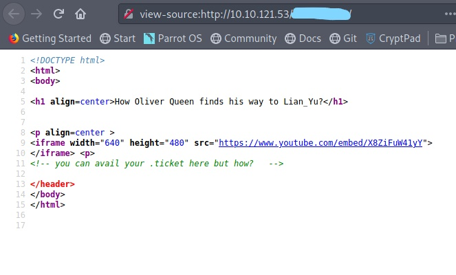
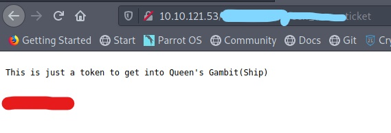
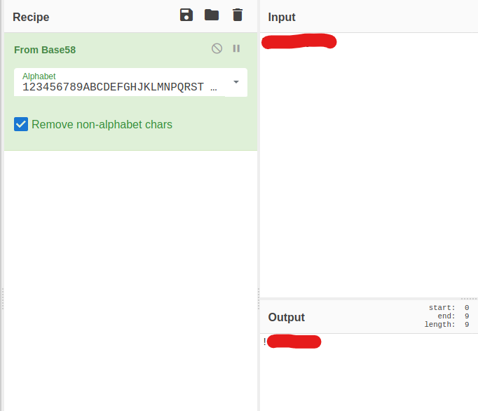
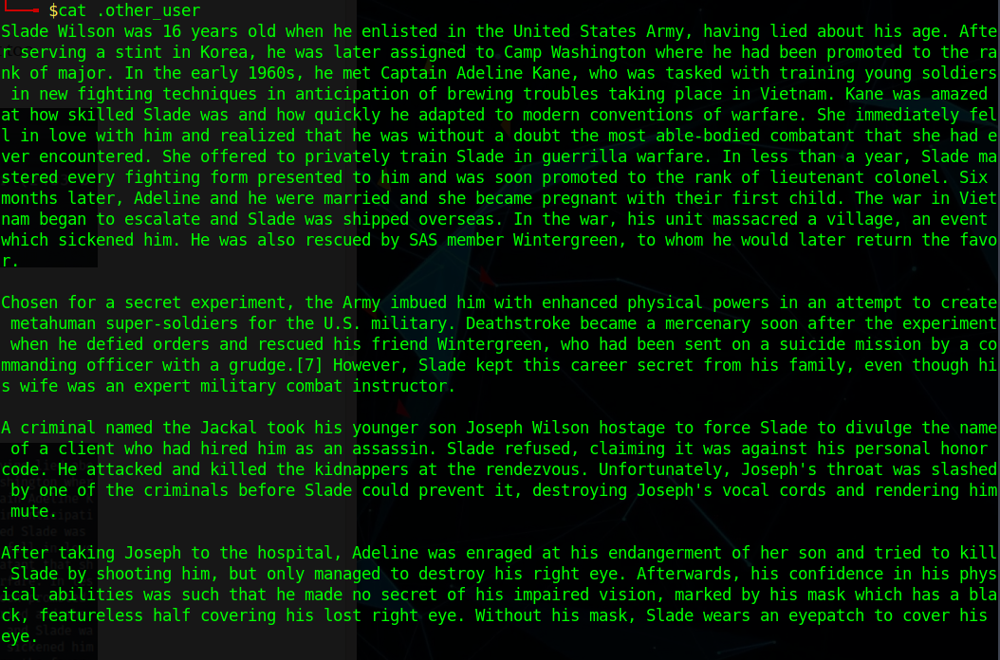
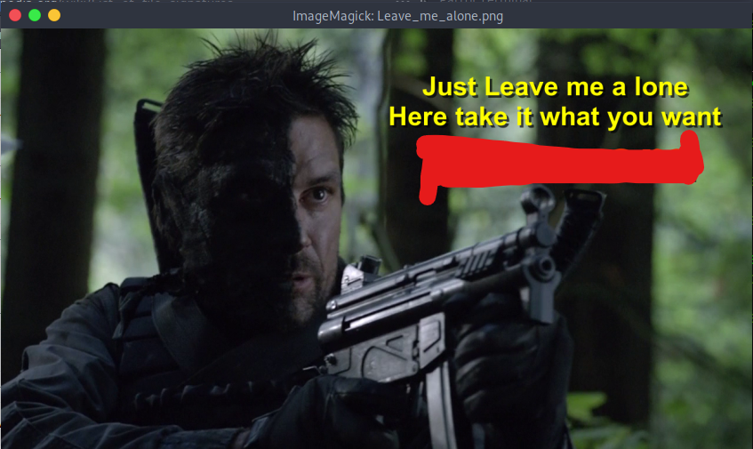
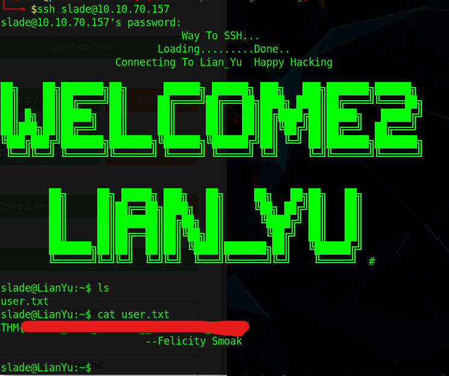
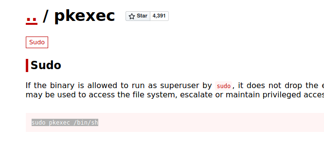
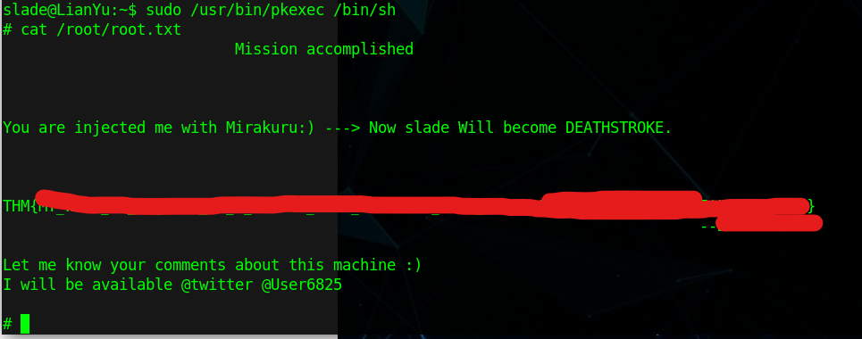

# Lian\_Yu

I started off by doing an nmap scan:

```text
nmap -T4 -A -oN nmaptxt 10.10.121.53
```

I then got the following output:

```text
Starting Nmap 7.91 ( https://nmap.org ) at 2021-03-18 00:47 GMT
Nmap scan report for 10.10.121.53
Host is up (0.20s latency).
Not shown: 996 closed ports
PORT STATE SERVICE VERSION
21/tcp open ftp vsftpd 3.0.2
22/tcp open ssh OpenSSH 6.7p1 Debian 5+deb8u8 (protocol 2.0)
| ssh-hostkey:
| 1024 56:50:bd:11:ef:d4:ac:56:32:c3:ee:73:3e:de:87:f4 (DSA)
| 2048 39:6f:3a:9c:b6:2d:ad:0c:d8:6d:be:77:13:07:25:d6 (RSA)
| 256 a6:69:96:d7:6d:61:27:96:7e:bb:9f:83:60:1b:52:12 (ECDSA)
| 256 3f:43:76:75:a8:5a:a6:cd:33:b0:66:42:04:91:fe:a0 (ED25519)
80/tcp open http Apache httpd
|_http-server-header: Apache
|_http-title: Purgatory
111/tcp open rpcbind 2-4 (RPC #100000)
| rpcinfo:
| program version port/proto service
| 100000 2,3,4 111/tcp rpcbind
| 100000 2,3,4 111/udp rpcbind
| 100000 3,4 111/tcp6 rpcbind
| 100000 3,4 111/udp6 rpcbind
| 100024 1 42412/tcp6 status
| 100024 1 52326/udp status
| 100024 1 52591/udp6 status
| 100024 1 58772/tcp status
Service Info: OSs: Unix, Linux; CPE: cpe:/o:linux:linux_kernel
```

I see 4 ports open. My first idea is to open the main page.


Here, the word "arrow" was bolded, so I saved it, just in case it could mean something later on. I then ran a gobuster command, in order to enumerate the directories on the server. I ran the following command:

```text
gobuster dir -u http://10.10.121.53/ -w ../resources/SecLists/Discovery/Web-Content/directory-list-2.3-small.txt -t 40
```

In the previous command, the wordlist I am using comes from [this github page](https://github.com/danielmiessler/SecLists). I then found a directory called: "is----". 

I then ran gobuster again with the addition of the new directory I had found:

```text
gobuster dir -u http://10.10.121.53/is----/ -w ../resources/SecLists/Discovery/Web-Content/directory-list-2.3-small.txt -t 40
```


I then found another director called "2---". Looking at the source of this website, I found this:



It is then shown that we need to find a file that has an extension with ".ticket". I then ran gobuster once more, but this time, I ran with an extension:

```text
gobuster dir -u http://10.10.121.53/island/2100/ -w ../resources/SecLists/Discovery/Web-Content/directory-list-2.3-small.txt -t 40 -x .ticket
```

I then found a file with a .ticket extension.



What I had crossed out in red was a password of some sort. I then had to look at the clue on the TryHackMe Lian\_Yu room. This led me to realize that the part crossed out in red was actually the ftp password in a base encoding. 


I then went to CyberChef, and was able to crack the password:



This gave me the ftp password. I then had to find the username. At this point, I did get stuck, and consulted [this write-up](https://infosecwriteups.com/tryhackme-lian-yu-ctf-writeup-detailed-7c229b1904fd) to find out what I missed. I realized that I had overlooked a word on a website. On the IP/is----/ website, I overlooked a word:


This word was in white, and I was unable to see it initially since it matched the background. I then used "vigilante" as the username, and then used the password for the ftp I got earlier. I then got into ftp:


Here I can see 4 files I need to get: The 2 PNGs, the one JPG and the last file was the ".other user" file. I downloaded all of them using "mget \*". This should download all the files to your local directory. Reading the ".other user", I came across this:



Here I can see various names, which could be potential usernames and/or passwords. One main name was "Slade" was what stuck out to me. I got stuck here once again. I then looked at the [previous write-up](https://infosecwriteups.com/tryhackme-lian-yu-ctf-writeup-detailed-7c229b1904fd), in order to realize that I had to run "steghide" on the aa.jpg file. When you run steghide, we need a password to extract the data from the aa.jpg file. This is where the Leave-me-alone.png file comes into play. The header for this file is messed up, so we have to edit the header. I found the header online on wikipedia:


I then edited the header of the file using the "hexeditor":


I was then able to view the file:



This turned out to be the password for the "steghide" command. Running the following command:


Entering the password from the "Leave-me-alone.jpg", I then got the output file:


I then found the password for the ssh server for the user "slade". I then entered those credentials and then I got into the server:



Here my first idea was to run "ls" to find out files in my current directory. I then saw the flag in a "user.txt" file. I then had to upgrade my privileges to root. To do this I ran "sudo -l". This command lets you know what commands our user can do as the root user. 


Here it can be seen that the command I can run as root is "pkexec". I then went to [https://gtfobins.github.io/](https://gtfobins.github.io/) in order to find out how I can use this command to get to root. I then found this webpage:



Running this command, I got to root



Reading the root.txt file, I saw the last flag and was able to complete the box!

